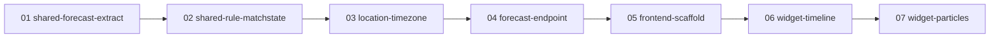

# window-widget — plan

Versionable red/green/refactor plan. One phase doc per step + a `prompt.md` runner.

Production implementation of the **Concept D v2 "Window" widget** (reference design:
`docs/concept-d-v2.html`) as a new page in the `web/` lambda: an animated wind-particle
map above a scrubbable forecast timeline (arrow strip · amber near-miss hatching ·
per-rule match lanes with tap-to-focus), driven by one shared time cursor.

Decisions locked with the user:

- **Data**: web lambda fetches the 4 providers live per page view (short in-memory
  cache). No forecast persistence, no scheduler dependency.
- **Scope**: forecast-only v1 — no observed/actual line (no observation source exists
  yet, improvement-ideas.md #19). The payload shape leaves room for it.
- **Frontend**: TypeScript + vite + vitest in `web/frontend/`, built to a single ESM
  bundle that is **committed** and embedded via `go:embed` (mirrors the repo's existing
  committed-generated-artifact convention: `alert-job/internal/mail_template.html`).
- **Go is the source of truth** for all domain logic: unit conversion (m/s → kn),
  aggregation (median / min / max / circular-mean direction), and 3-state rule matching.
  TypeScript renders a fully pre-chewed payload — it never re-implements rules.

## How to run
`/plan execute phase1` (one phase at a time). See `prompt.md` for the ceremony and guardrails.

## Why these steps (and why not bespoke)

- **vite + vitest** — industry standard, already proven in the sibling
  `../wind-range-widget` repo; no bespoke bundler/test rig.
- **No charting library** — bespoke SVG is justified: the timeline is a unique
  composite (envelope + patterned rule band + hatched washes + arrow strip + match
  lanes + scrub cursor, all sharing one x-scale). No off-the-shelf chart provides it,
  D3 would be a heavyweight dependency for ~300 lines of layout math, and the
  no-CDN/CSP constraint (web/ARCH.md) demands vendored, auditable code anyway.
- **Tiny `svgEl()` attribute helper instead of lit-html/JSX** — ~15 lines, zero deps,
  keeps layer functions readable (`svgEl("rect", { x, y, width, height })`).
- **Manual TS ↔ Go payload type mirror + one shared golden fixture** instead of
  codegen (OpenAPI/quicktype): one endpoint, one payload. The fixture
  (`web/frontend/fixtures/forecast-payload.json`) is asserted byte-identical by a Go
  test and parsed by a TS test — a cross-language contract test without a toolchain.
  Revisit codegen only if a second endpoint appears.
- **Particle engine vendored from `../wind-range-widget`** (MIT, same author) rather
  than depended on via npm: we reuse the engine, not the form-control custom element,
  and we change its drive model (scrub-driven config instead of a sweep cycle).

## Phase order

Strictly linear: each phase ships one invariant the next builds on. Phases 01–03 are
pure Go groundwork (03 also fixes the standing UTC-vs-local rule-hours bug on its own
merit), 04 exposes the data, 05–07 build the widget.

## Phases
| id | title |
|---|---|
| phase01 | shared-forecast-extract |
| phase02 | shared-rule-matchstate |
| phase03 | location-timezone |
| phase04 | forecast-endpoint |
| phase05 | frontend-scaffold |
| phase06 | widget-timeline |
| phase07 | widget-particles |
